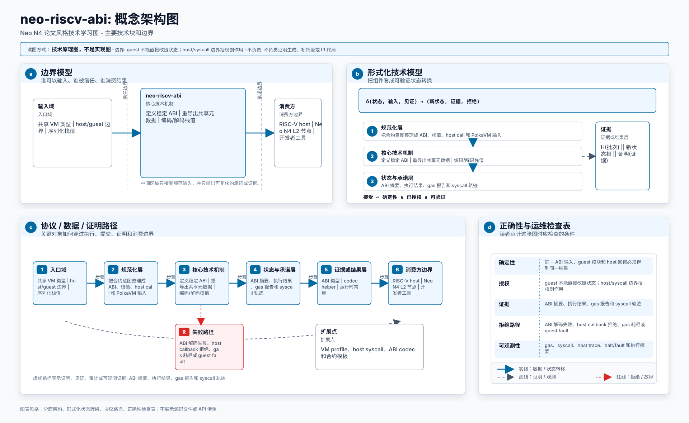
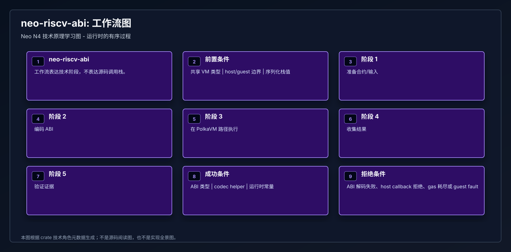
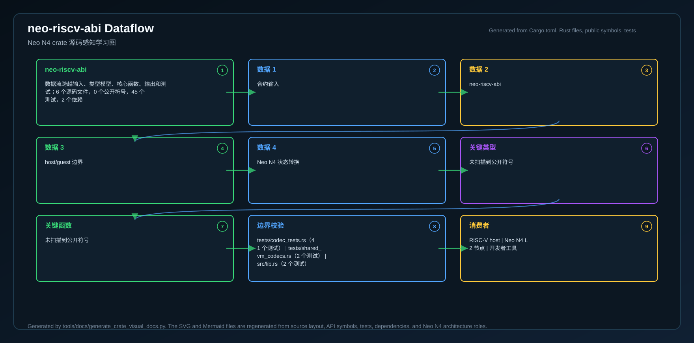

# neo-riscv-abi

<!-- N4-CRATE-VISUAL-GUIDE-ZH:START -->

## 可视化架构学习指南

这些图用于说明 `neo-riscv-abi` 在 Neo N4 栈中的位置、主要工作流，以及数据如何流经该 crate。

| 视图 | 图片 | 源文件 |
| --- | --- | --- |
| 架构 |  | [Mermaid](docs/figures/architecture.zh.mmd) |
| 工作流 |  | [Mermaid](docs/figures/workflow.zh.mmd) |
| 数据流 |  | [Mermaid](docs/figures/dataflow.zh.mmd) |

### 在 Neo N4 中的作用

- **层级:** NeoVM2 / RISC-V 执行 profile
- **目的:** RISC-V 执行路径共享的 ABI、栈值、codec tag 与 opcode 元数据重导出。
- **主要输入:** 共享 VM 类型、host/guest 边界、序列化栈值
- **主要输出:** ABI 类型、codec helper、运行时常量
- **下游消费者:** RISC-V host、Neo N4 L2 节点、开发者工具

### 学习路径

1. 先看架构图，理解 crate 的边界和所在层级。
2. 再看工作流图，理解正常执行路径。
3. 最后看数据流图，把输入、状态变化和输出串起来。
4. 带着图中的上下文阅读源码，会更容易理解模块职责。

<!-- N4-CRATE-VISUAL-GUIDE-ZH:END -->
