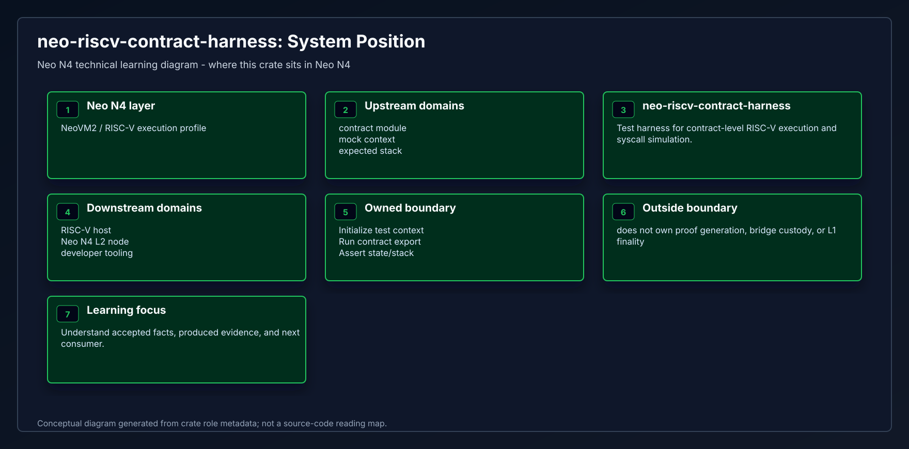
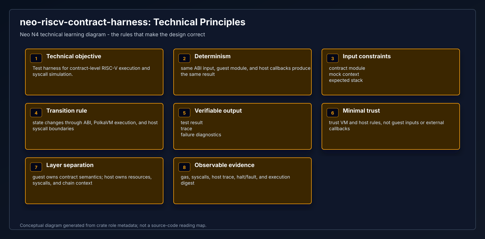
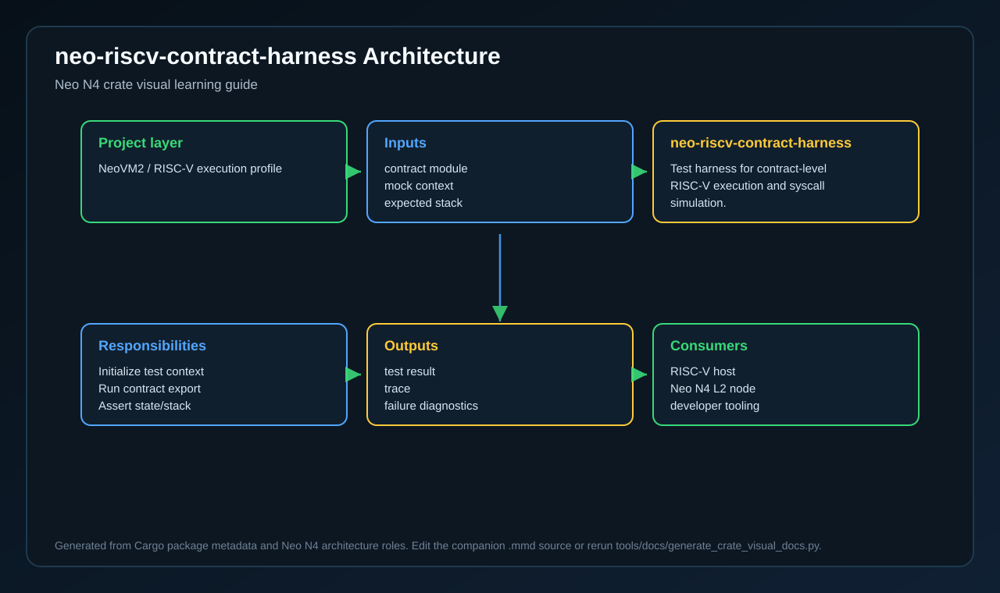
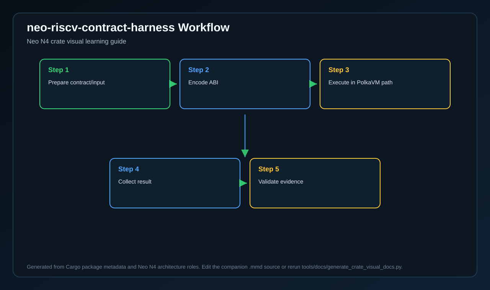
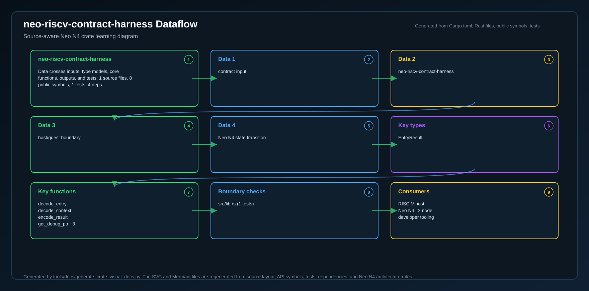
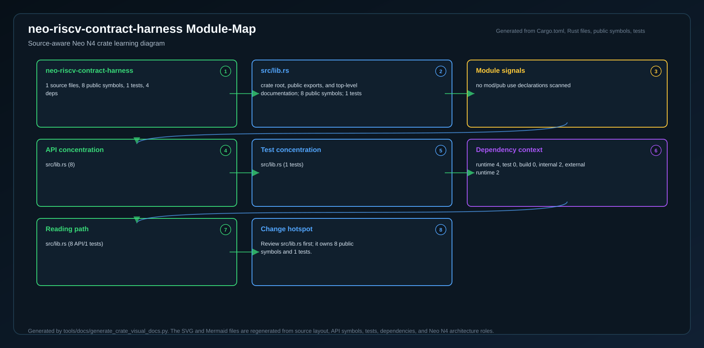
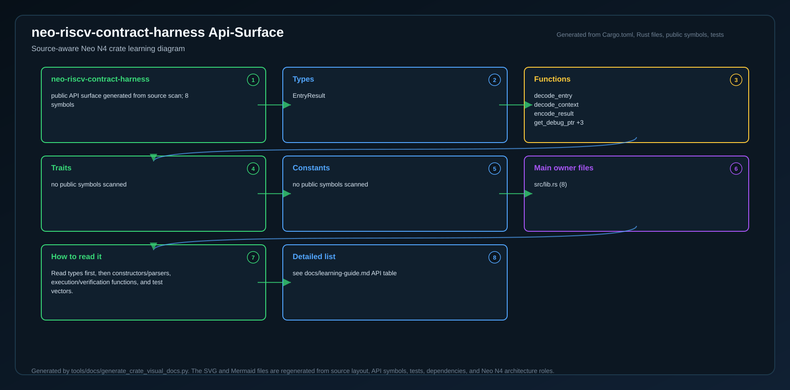
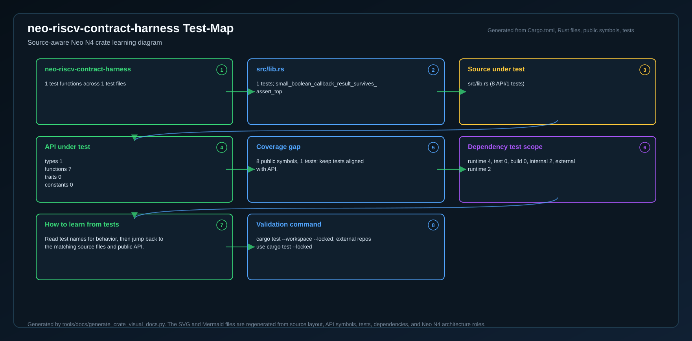
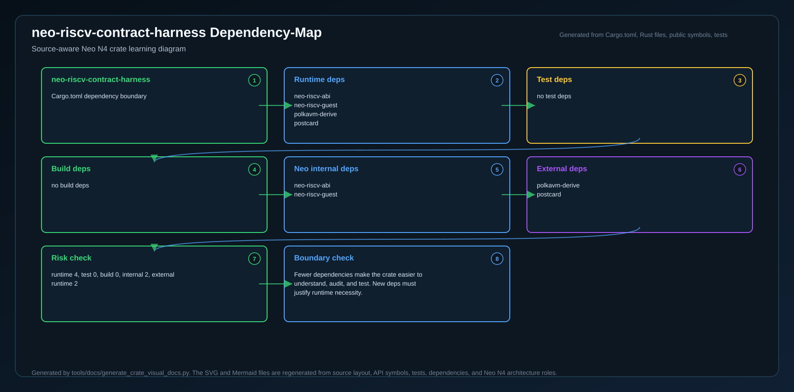
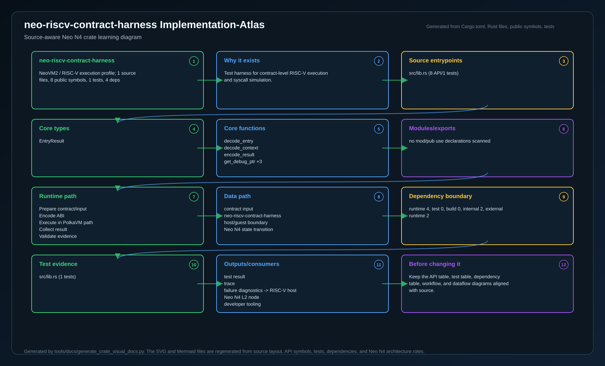

# neo-riscv-contract-harness

<!-- N4-CRATE-VISUAL-GUIDE:START -->

## Crate Visual Learning Guide

These diagrams are local to this crate. They explain `neo-riscv-contract-harness` as an independent unit: where it sits in the Neo N4 stack, which boundary it owns, how its internal workflow runs, and how data moves through it.

For the full source-level explanation, read [docs/learning-guide.md](docs/learning-guide.md).

| View | Diagram | Source |
| --- | --- | --- |
| Position in Neo N4 |  | [Mermaid](docs/figures/position.mmd) |
| Technical principles |  | [Mermaid](docs/figures/principles.mmd) |
| Architecture |  | [Mermaid](docs/figures/architecture.mmd) |
| Workflow |  | [Mermaid](docs/figures/workflow.mmd) |
| Dataflow |  | [Mermaid](docs/figures/dataflow.mmd) |
| Module map |  | [Mermaid](docs/figures/module-map.mmd) |
| Public API surface |  | [Mermaid](docs/figures/api-surface.mmd) |
| Test evidence |  | [Mermaid](docs/figures/test-map.mmd) |
| Dependency map |  | [Mermaid](docs/figures/dependency-map.mmd) |
| Implementation atlas |  | [Mermaid](docs/figures/implementation-atlas.mmd) |

### Role in Neo N4

- **Layer:** NeoVM2 / RISC-V execution profile
- **Purpose:** Test harness for contract-level RISC-V execution and syscall simulation.
- **Primary inputs:** contract module, mock context, expected stack
- **Primary outputs:** test result, trace, failure diagnostics
- **Downstream consumers:** RISC-V host, Neo N4 L2 node, developer tooling
- **Source files scanned:** 1
- **Public symbols scanned:** 8
- **Rust tests scanned:** 1

### Boundary and Responsibilities

- **Owns:** Initialize test context, Run contract export, Assert state/stack
- **Consumes:** contract module, mock context, expected stack
- **Produces:** test result, trace, failure diagnostics
- **Used by:** RISC-V host, Neo N4 L2 node, developer tooling

### Source Map Snapshot

| File | Why it matters | Public API | Tests |
| --- | --- | ---: | ---: |
| `src/lib.rs` | crate root, public exports, and top-level documentation | 8 | 1 |

### API Snapshot

| Kind | Representative symbols |
| --- | --- |
| Types | EntryResult |
| Functions | decode_entry   decode_context   encode_result   get_debug_ptr +3 |
| Trait | no public symbols scanned |
| Constants | no public symbols scanned |

### Learning Path

1. Start with the position diagram to understand why this crate exists and who calls it.
2. Read the technical principles diagram to identify the invariants and responsibility boundary.
3. Use the module map and API surface to identify the files and symbols to read first.
4. Follow the workflow, dataflow, test, and dependency diagrams before changing code.
5. Use the implementation atlas as the compact source-reading map when you want one dense view instead of separate technical views.

<!-- N4-CRATE-VISUAL-GUIDE:END -->
