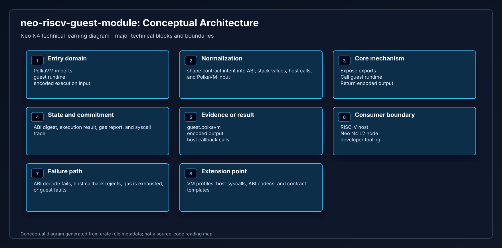
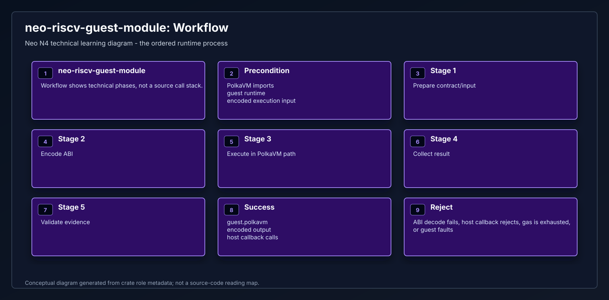
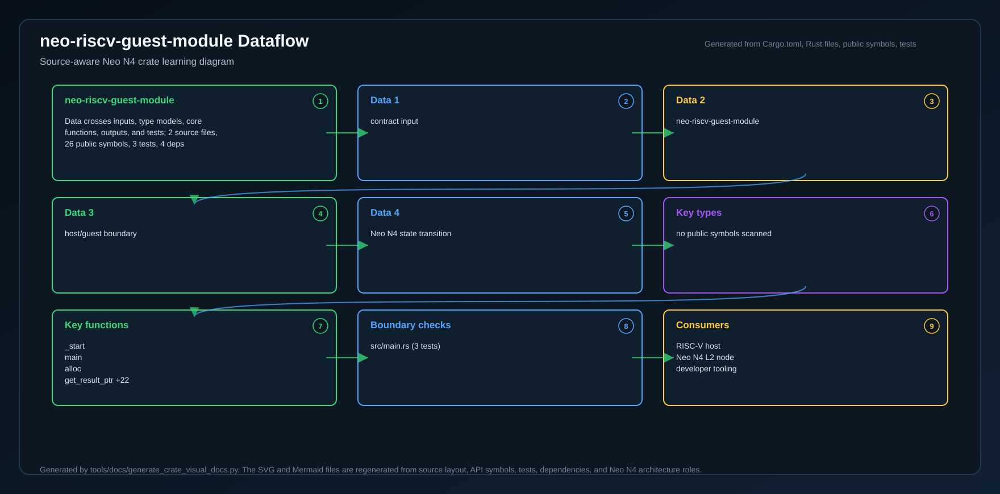

# neo-riscv-guest-module

<!-- N4-CRATE-VISUAL-GUIDE:START -->

## Visual Architecture Guide

These diagrams explain where `neo-riscv-guest-module` sits in the Neo N4 stack, how its main workflow runs, and how data moves through it.

| View | Diagram | Source |
| --- | --- | --- |
| Architecture |  | [Mermaid](docs/figures/architecture.mmd) |
| Workflow |  | [Mermaid](docs/figures/workflow.mmd) |
| Dataflow |  | [Mermaid](docs/figures/dataflow.mmd) |

### Role in Neo N4

- **Layer:** NeoVM2 / RISC-V execution profile
- **Purpose:** PolkaVM guest module entrypoint that packages the guest runtime into executable RISC-V code.
- **Primary inputs:** PolkaVM imports, guest runtime, encoded execution input
- **Primary outputs:** guest.polkavm, encoded output, host callback calls
- **Downstream consumers:** RISC-V host, Neo N4 L2 node, developer tooling

### Learning Path

1. Start with the architecture diagram to understand the crate boundary.
2. Follow the workflow diagram to see the normal execution path.
3. Use the dataflow diagram to connect inputs, state changes, and outputs.
4. Read the crate source after the diagrams so module-level details have context.

<!-- N4-CRATE-VISUAL-GUIDE:END -->
