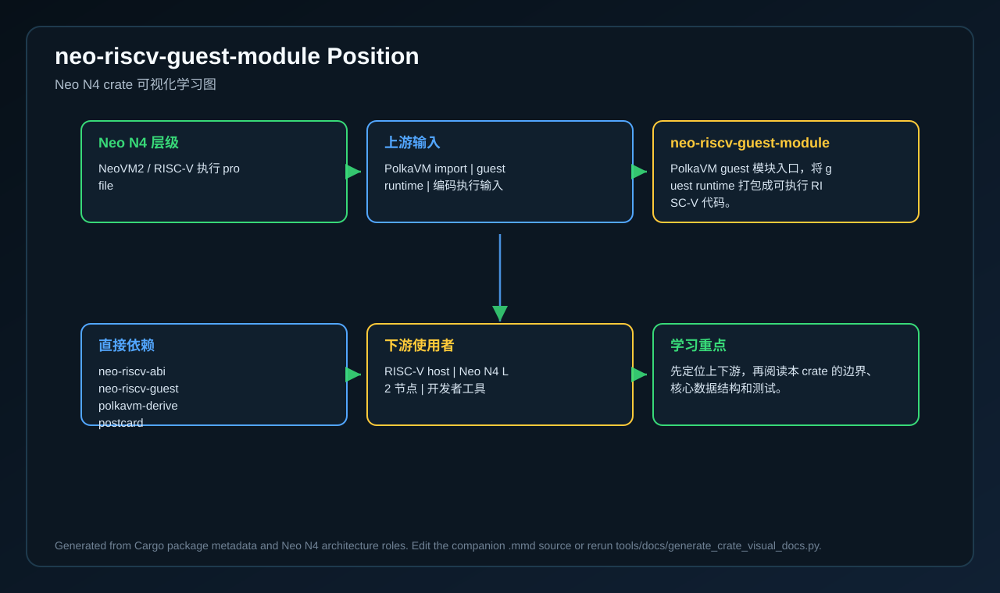
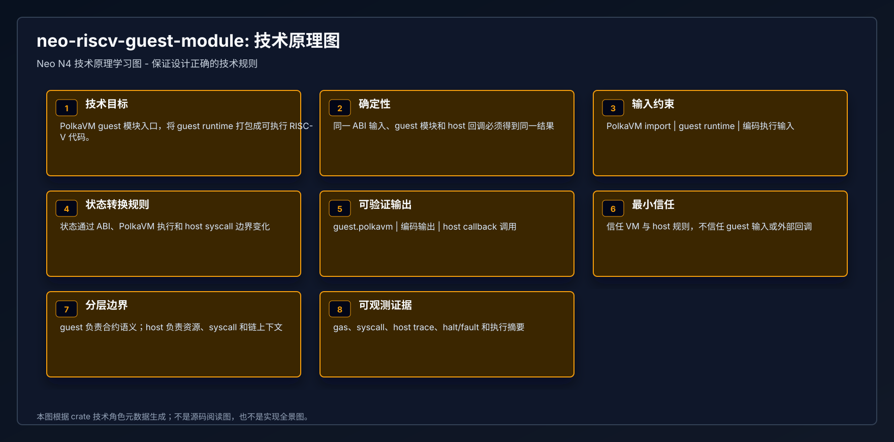
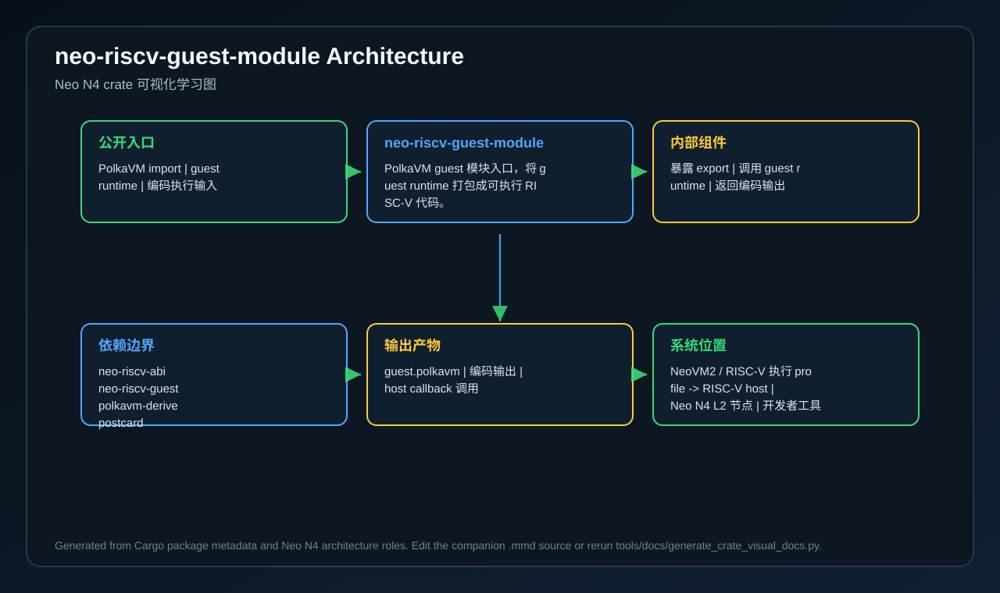
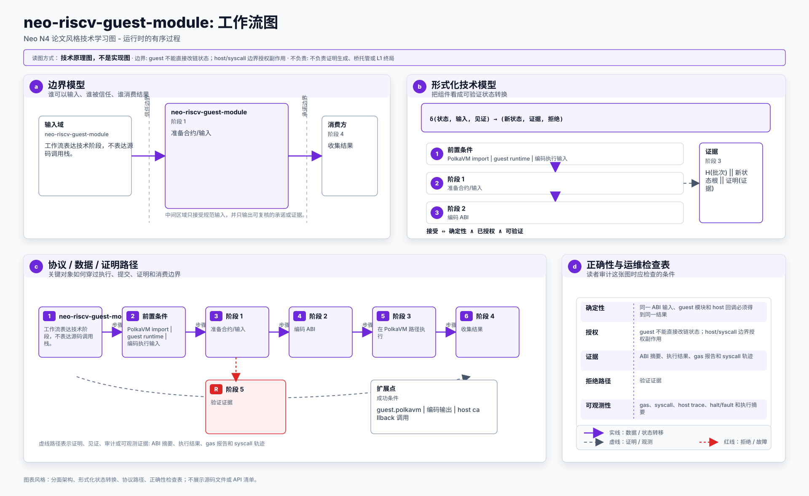
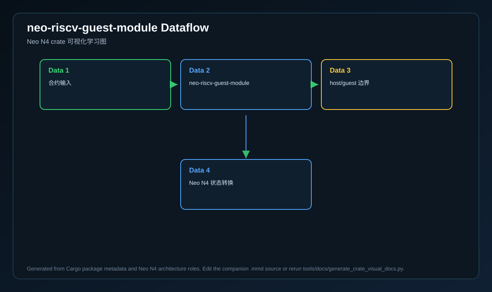
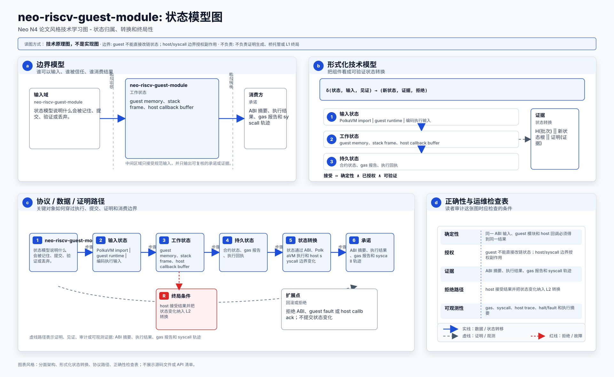
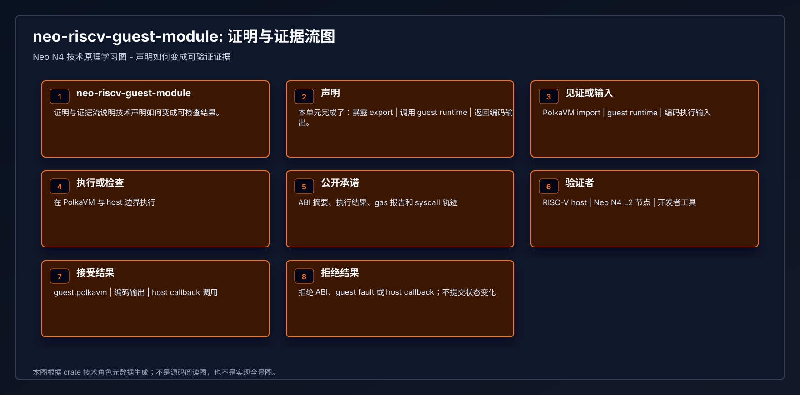
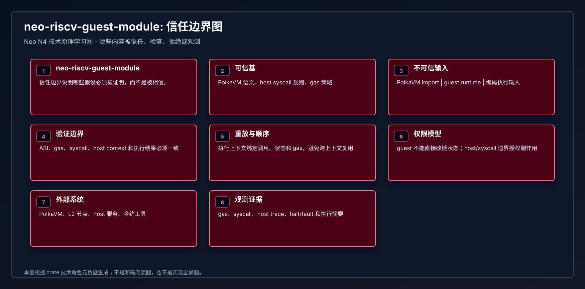
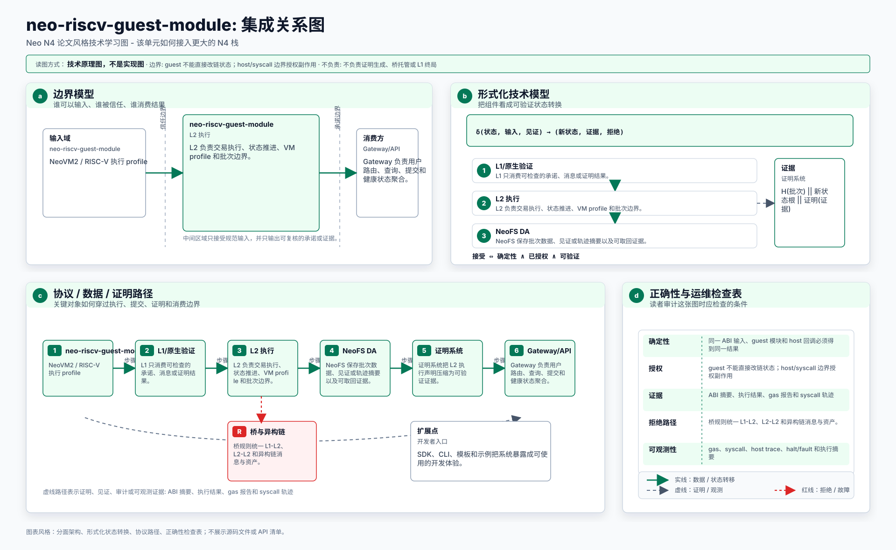
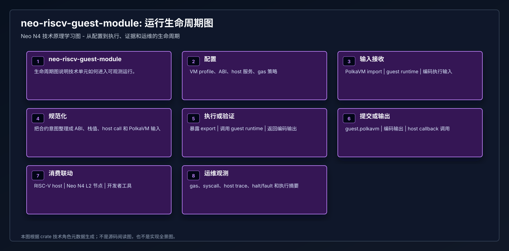

# neo-riscv-guest-module

<!-- N4-CRATE-VISUAL-GUIDE-ZH:START -->
## 技术可视化指南

这些图都放在本 crate 目录下，用技术架构视角解释 `neo-riscv-guest-module`。重点是系统位置、技术原理、数据移动、工作流、状态、证明/证据、信任边界、集成关系和运行生命周期。

完整技术解释见 [docs/learning-guide.zh.md](docs/learning-guide.zh.md)。

| 视图 | 图 | Mermaid |
| --- | --- | --- |
| 系统位置图 |  | [Mermaid](docs/figures/position.zh.mmd) |
| 技术原理图 |  | [Mermaid](docs/figures/principles.zh.mmd) |
| 概念架构图 |  | [Mermaid](docs/figures/architecture.zh.mmd) |
| 工作流图 |  | [Mermaid](docs/figures/workflow.zh.mmd) |
| 数据流图 |  | [Mermaid](docs/figures/dataflow.zh.mmd) |
| 状态模型图 |  | [Mermaid](docs/figures/state-model.zh.mmd) |
| 证明与证据流图 |  | [Mermaid](docs/figures/proof-flow.zh.mmd) |
| 信任边界图 |  | [Mermaid](docs/figures/trust-boundaries.zh.mmd) |
| 集成关系图 |  | [Mermaid](docs/figures/integration-map.zh.mmd) |
| 运行生命周期图 |  | [Mermaid](docs/figures/lifecycle.zh.mmd) |

### 技术角色

- **层级:** NeoVM2 / RISC-V 执行 profile
- **目的:** PolkaVM guest 模块入口，将 guest runtime 打包成可执行 RISC-V 代码。
- **输入:** PolkaVM import | guest runtime | 编码执行输入
- **职责:** 暴露 export | 调用 guest runtime | 返回编码输出
- **输出:** guest.polkavm | 编码输出 | host callback 调用
- **消费方:** RISC-V host | Neo N4 L2 节点 | 开发者工具

### 阅读顺序

1. 先看系统位置图和概念架构图。
2. 再看技术原理图、信任边界图和状态模型图，理解为什么这样设计是正确的。
3. 然后看工作流图和数据流图，理解运行时如何移动。
4. 最后看证明/证据流、集成关系和生命周期，理解系统如何进入真实运行。
<!-- N4-CRATE-VISUAL-GUIDE-ZH:END -->
