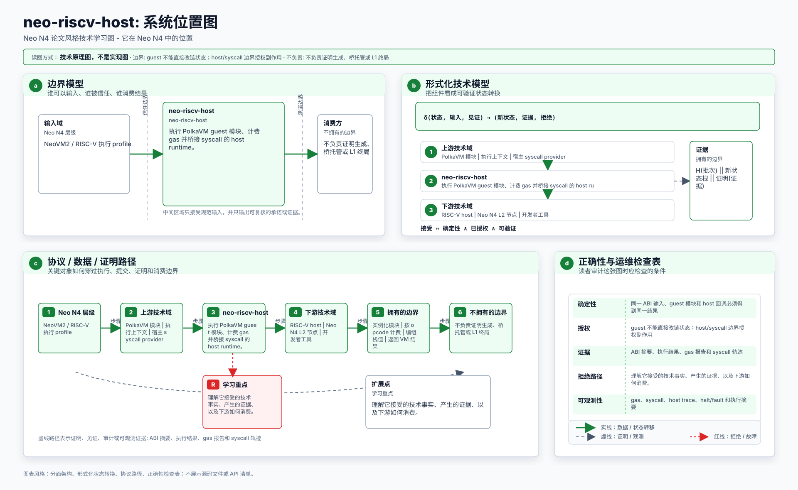
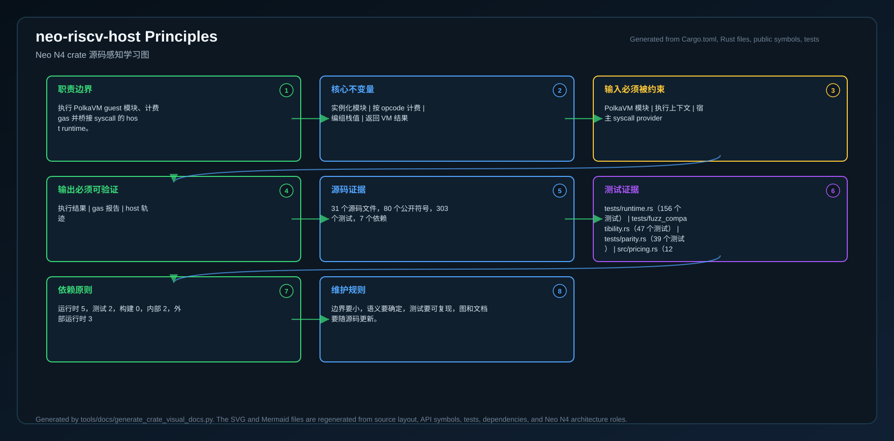
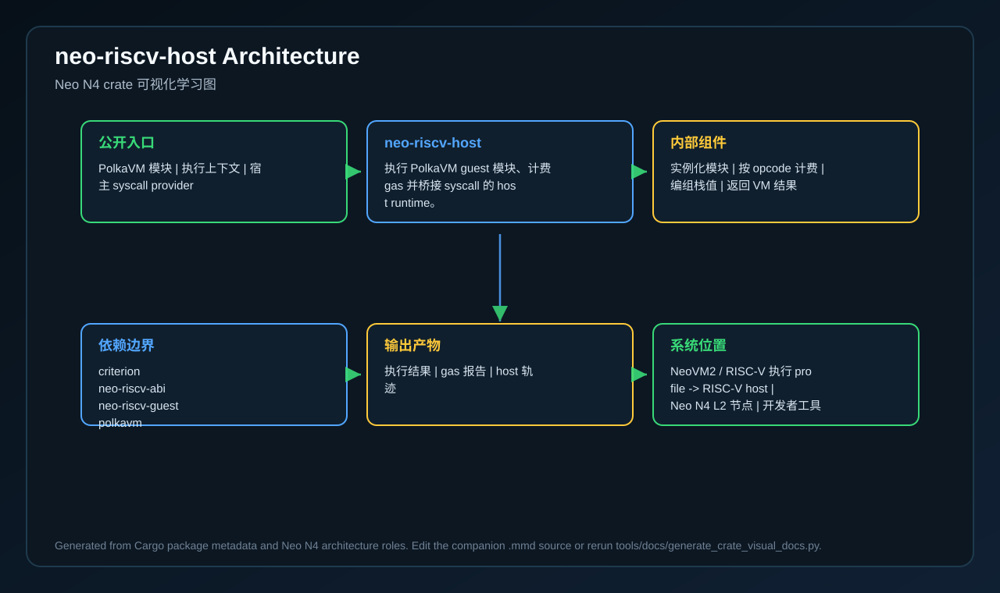
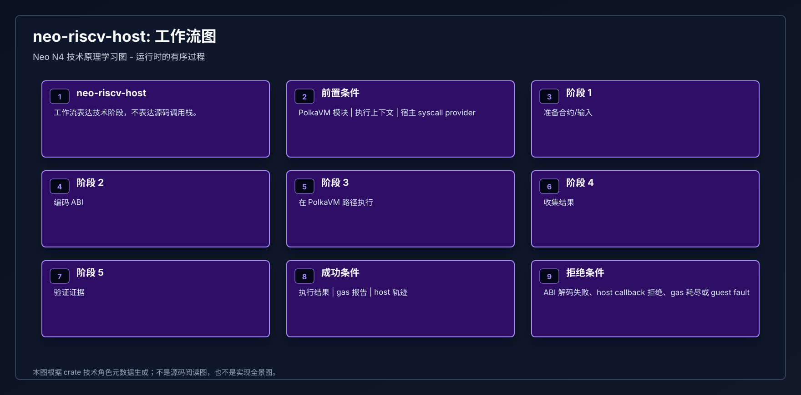
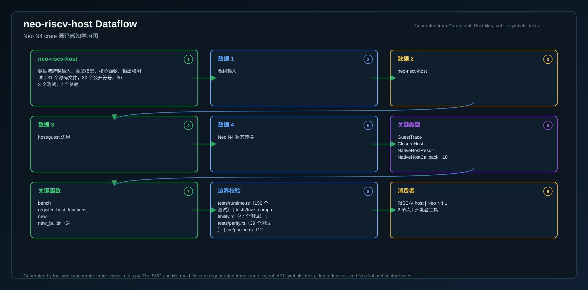
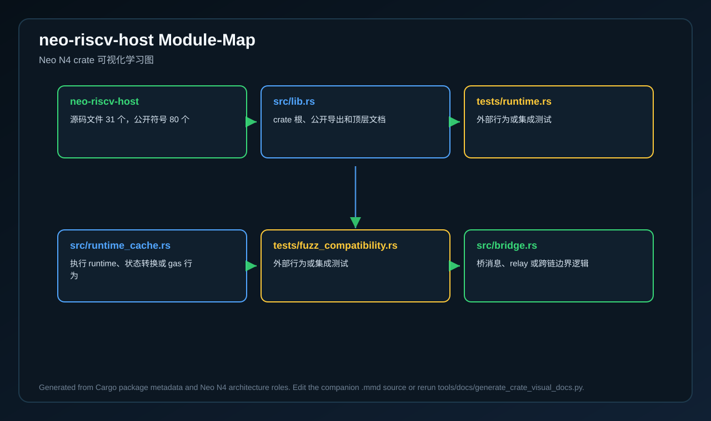
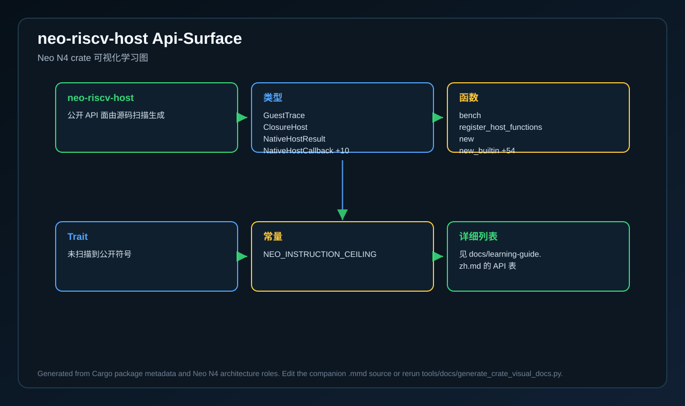
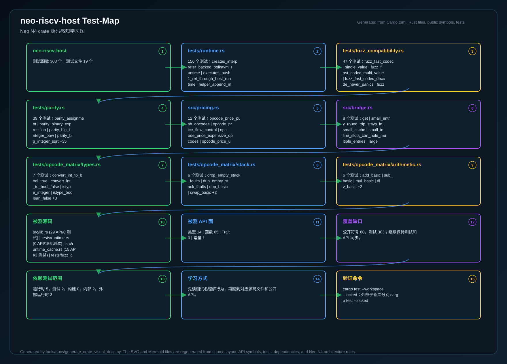
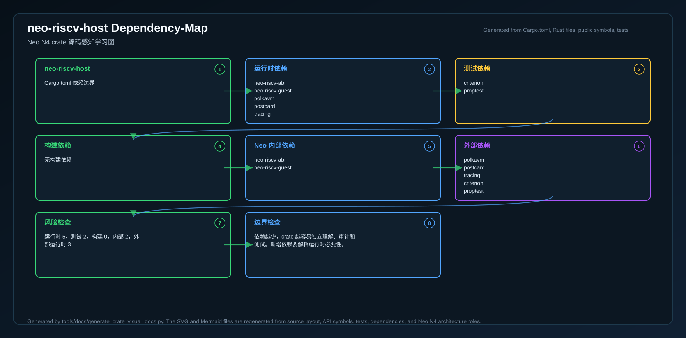
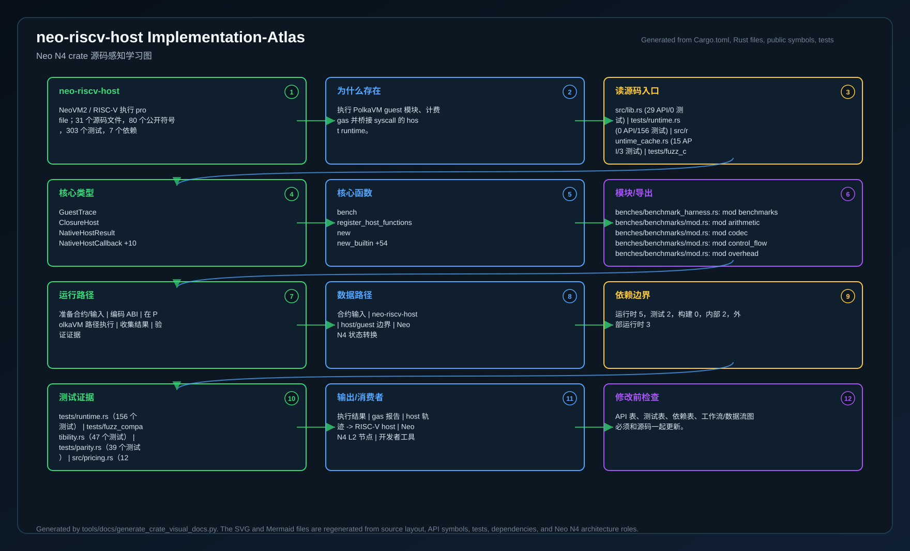

# neo-riscv-host

<!-- N4-CRATE-VISUAL-GUIDE-ZH:START -->

## 可视化学习指南

这些图是 `neo-riscv-host` 自己目录下的 crate 专属学习资料，用来说明它在 Neo N4 中的位置、自己负责的技术边界、内部工作流，以及数据如何流经它。

完整的源码级解释见 [docs/learning-guide.zh.md](docs/learning-guide.zh.md)。

| 视图 | 图片 | 源文件 |
| --- | --- | --- |
| 在 Neo N4 中的位置 |  | [Mermaid](docs/figures/position.zh.mmd) |
| 技术原理 |  | [Mermaid](docs/figures/principles.zh.mmd) |
| 架构 |  | [Mermaid](docs/figures/architecture.zh.mmd) |
| 工作流 |  | [Mermaid](docs/figures/workflow.zh.mmd) |
| 数据流 |  | [Mermaid](docs/figures/dataflow.zh.mmd) |
| 模块图 |  | [Mermaid](docs/figures/module-map.zh.mmd) |
| 公开 API 图 |  | [Mermaid](docs/figures/api-surface.zh.mmd) |
| 测试证据图 |  | [Mermaid](docs/figures/test-map.zh.mmd) |
| 依赖图 |  | [Mermaid](docs/figures/dependency-map.zh.mmd) |
| 实现全景图 |  | [Mermaid](docs/figures/implementation-atlas.zh.mmd) |

### 在 Neo N4 中的作用

- **层级:** NeoVM2 / RISC-V 执行 profile
- **目的:** 执行 PolkaVM guest 模块、计费 gas 并桥接 syscall 的 host runtime。
- **主要输入:** PolkaVM 模块、执行上下文、宿主 syscall provider
- **主要输出:** 执行结果、gas 报告、host 轨迹
- **下游使用者:** RISC-V host、Neo N4 L2 节点、开发者工具
- **扫描到的源码文件:** 31
- **扫描到的公开符号:** 80
- **扫描到的 Rust 测试:** 303

### 边界与职责

- **本 crate 负责:** 实例化模块、按 opcode 计费、编组栈值、返回 VM 结果
- **本 crate 消费:** PolkaVM 模块、执行上下文、宿主 syscall provider
- **本 crate 产出:** 执行结果、gas 报告、host 轨迹
- **主要被谁使用:** RISC-V host、Neo N4 L2 节点、开发者工具

### 源码地图快照

| 文件 | 为什么重要 | 公开 API | 测试 |
| --- | --- | ---: | ---: |
| `src/lib.rs` | crate 根、公开导出和顶层文档 | 29 | 0 |
| `tests/runtime.rs` | 外部行为或集成测试 | 0 | 156 |
| `src/runtime_cache.rs` | 执行 runtime、状态转换或 gas 行为 | 15 | 3 |
| `tests/fuzz_compatibility.rs` | 外部行为或集成测试 | 0 | 47 |
| `src/bridge.rs` | 桥消息、relay 或跨链边界逻辑 | 11 | 8 |
| `tests/parity.rs` | 外部行为或集成测试 | 0 | 39 |
| `src/pricing.rs` | 实现细节或辅助模块 | 6 | 12 |
| `src/ffi.rs` | 实现细节或辅助模块 | 6 | 0 |

### API 快照

| 类型 | 代表符号 |
| --- | --- |
| 类型 | GuestTrace   ClosureHost   NativeHostResult   NativeHostCallback +10 |
| 函数 | bench   register_host_functions   new   new_builtin +54 |
| Trait | 未扫描到公开符号 |
| 常量 | NEO_INSTRUCTION_CEILING |

### 学习路径

1. 先看位置图，明确这个 crate 为什么存在、上游是谁、下游是谁。
2. 再看技术原理图，理解它的核心不变量、职责边界和维护规则。
3. 然后看模块图和 API 图，确定先读哪些文件、哪些符号。
4. 最后看工作流、数据流、测试证据图和依赖图，再进入源码会更容易理解。
5. 如果希望一张图看完整体，就看实现全景图；它把源码入口、API、数据流、测试、依赖和修改检查点放在一起。

<!-- N4-CRATE-VISUAL-GUIDE-ZH:END -->
