# Neo RISC-V VM Diagrams / Neo RISC-V VM 图解

Professional bilingual diagrams for explaining how NeoVM compatibility runs inside Neo's RISC-V execution stack.

用于解释 NeoVM 兼容层如何运行在 Neo RISC-V 执行栈中的专业中英文图解。

Regenerate all diagrams:

```bash
node docs/diagrams/generate-diagrams.mjs
```

## English Set

Generated SVG diagrams. Edit generate-diagrams.mjs, then rerun node docs/diagrams/generate-diagrams.mjs.

| Diagram | Image |
| --- | --- |
| System Architecture | 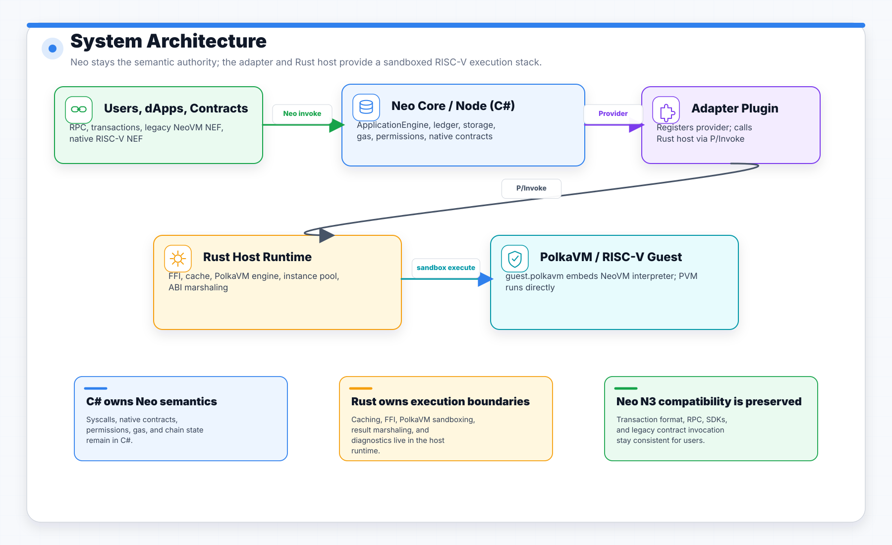 |
| Execution Routing |  |
| NeoVM Inside RISC-V | 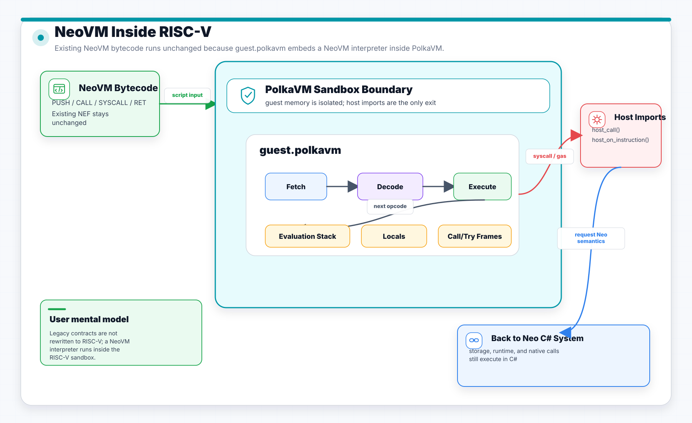 |
| Syscall and Native Contract Data Flow | 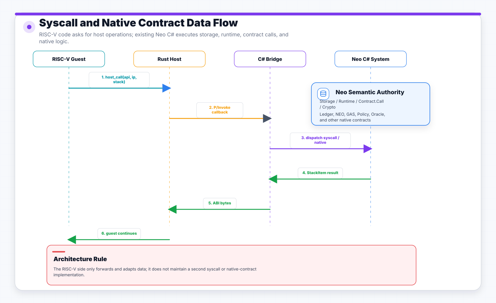 |
| ABI and Memory Model | 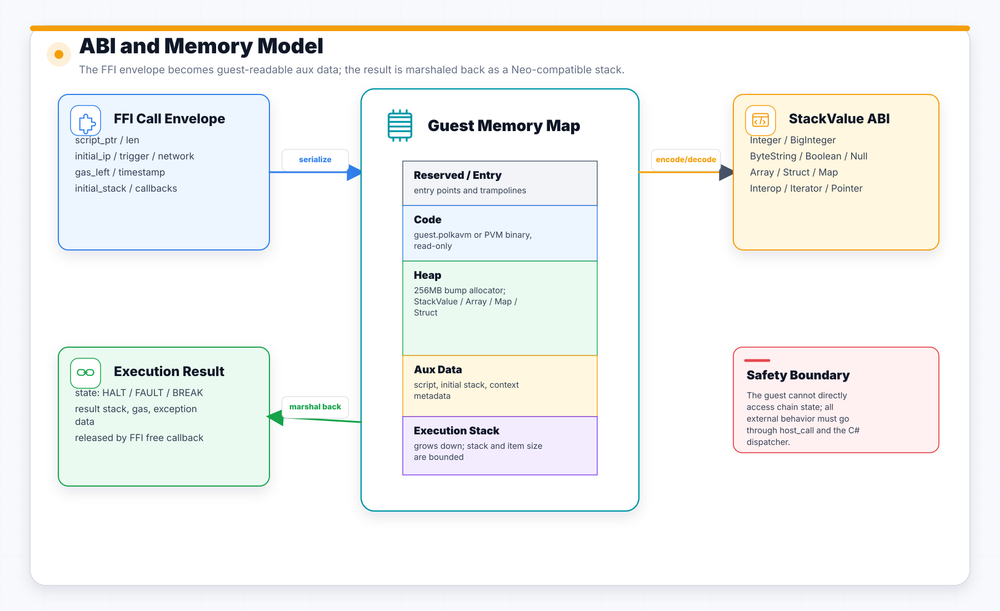 |
| Contract Deployment Workflow | 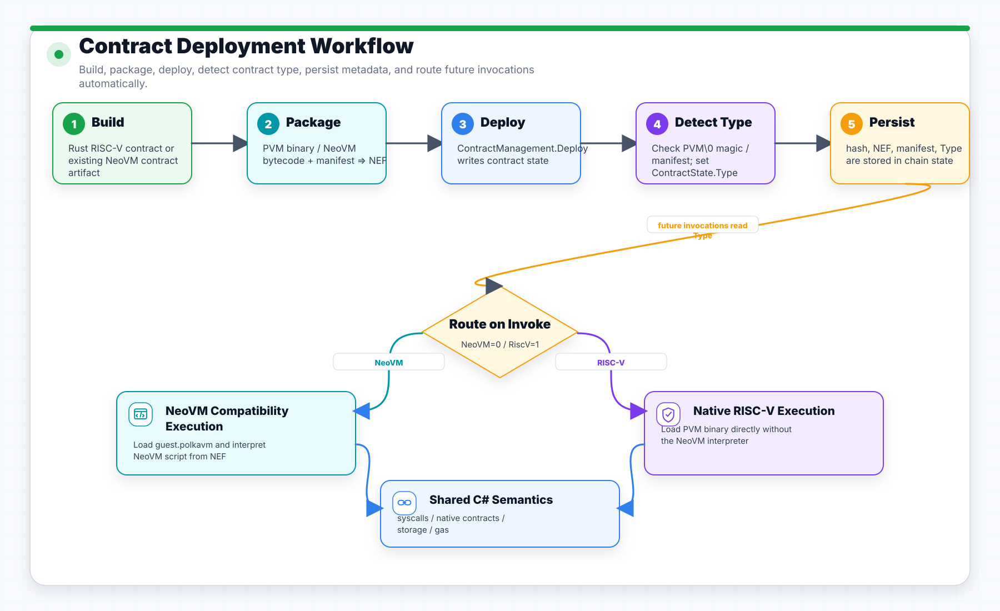 |
| Mainnet State Root Validation | 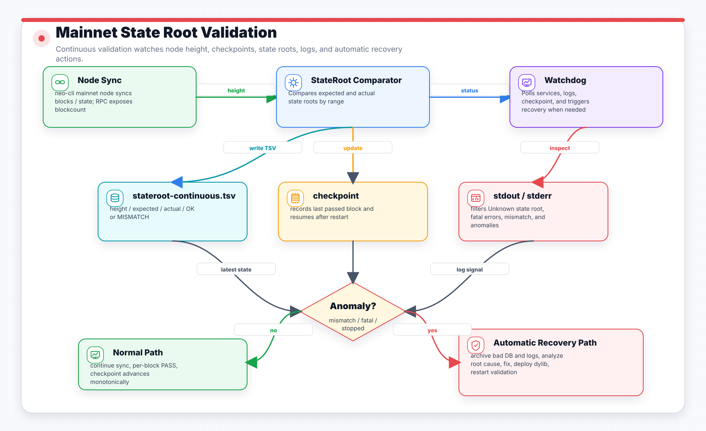 |

## 中文图集

生成式 SVG 图集。修改 generate-diagrams.mjs 后运行 node docs/diagrams/generate-diagrams.mjs 重新生成。

| 图 | 图片 |
| --- | --- |
| 系统总体架构 | 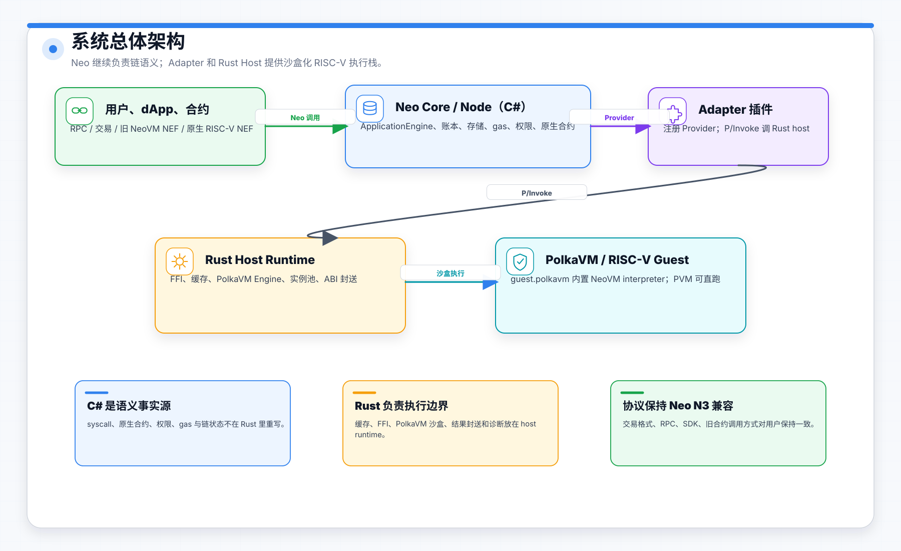 |
| 执行路由 | 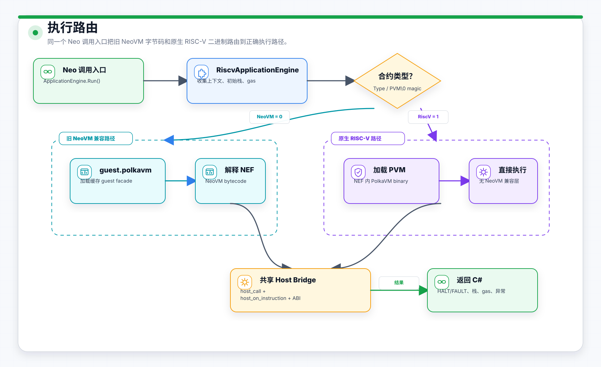 |
| NeoVM 运行在 RISC-V 中 | 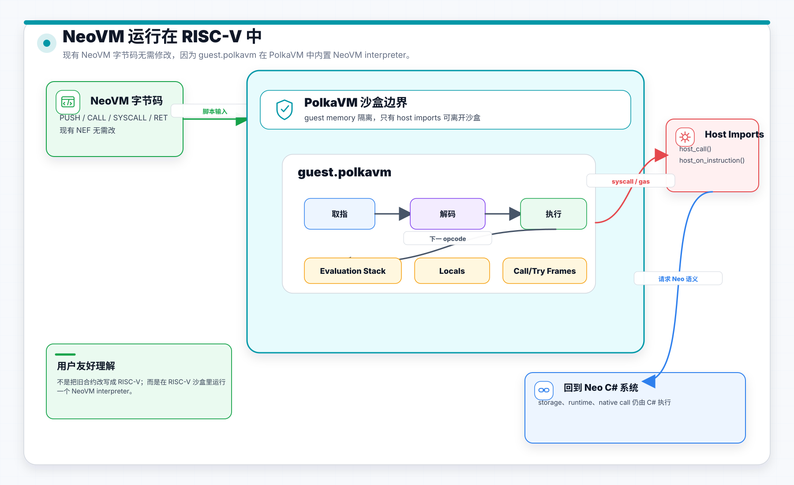 |
| Syscall 与原生合约数据流 | 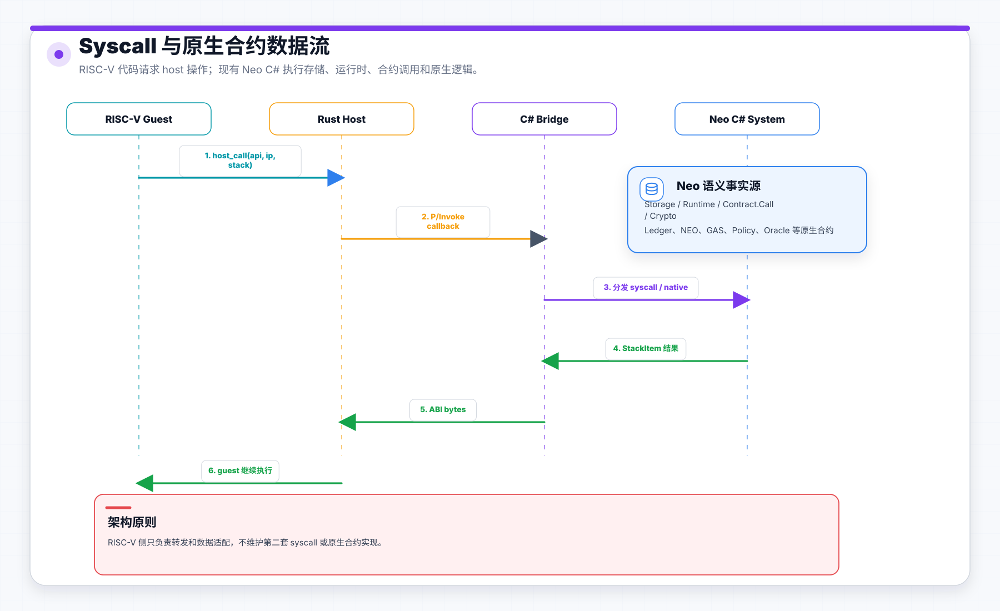 |
| ABI 与内存模型 | 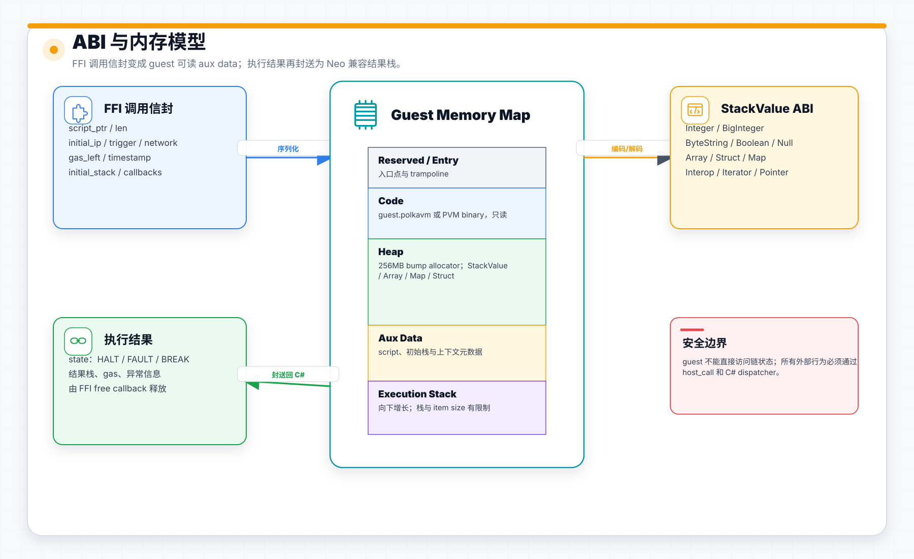 |
| 合约部署工作流 | 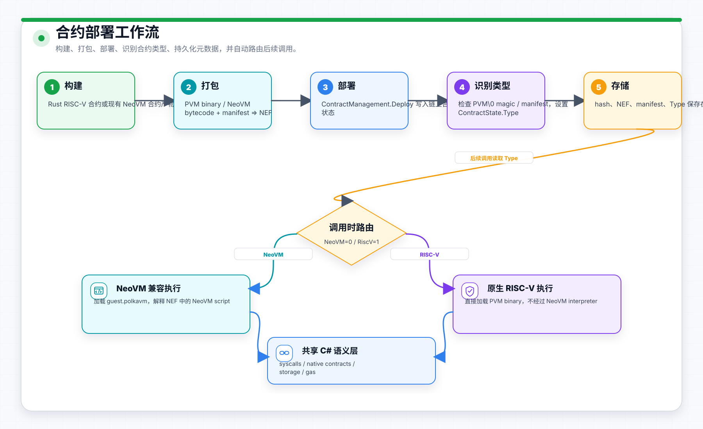 |
| 主网 StateRoot 校验 | 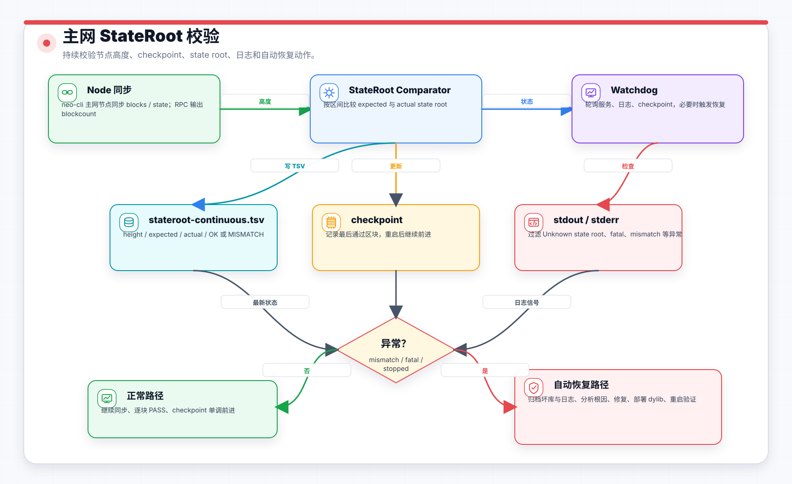 |
