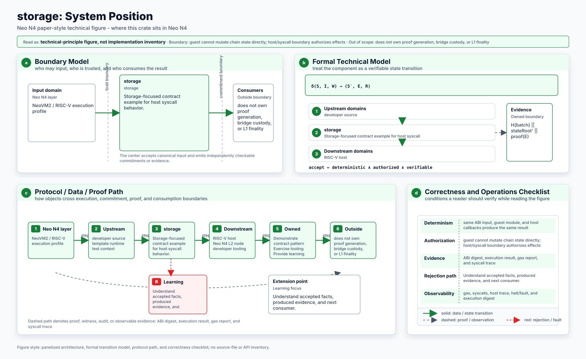
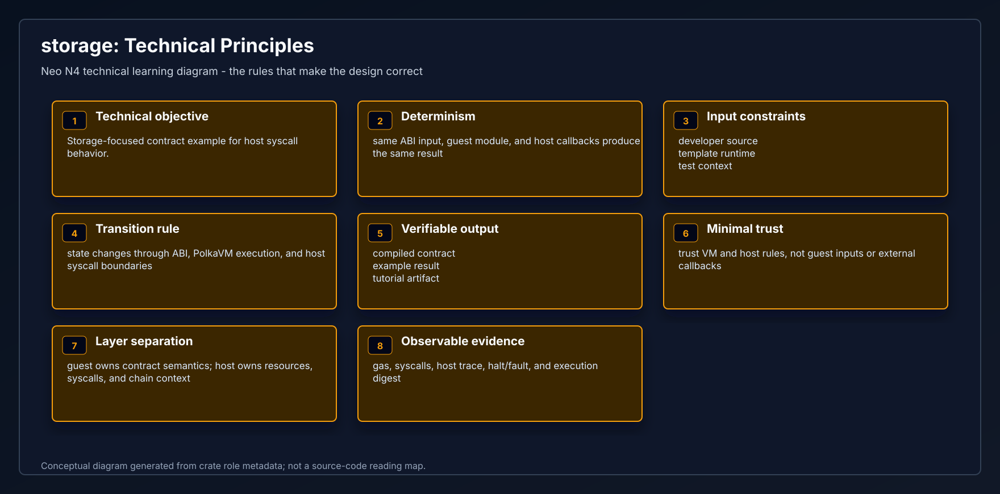
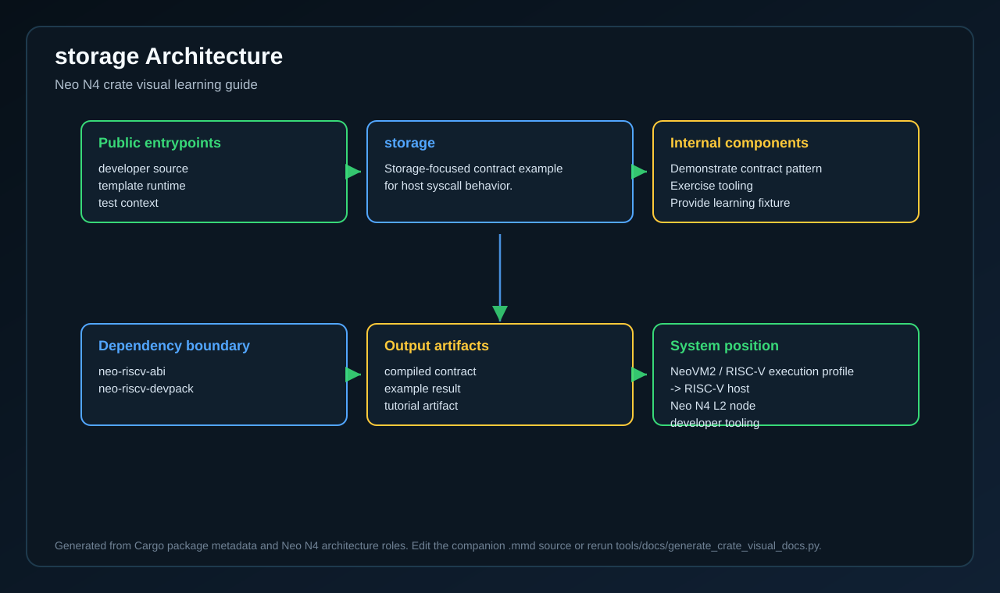
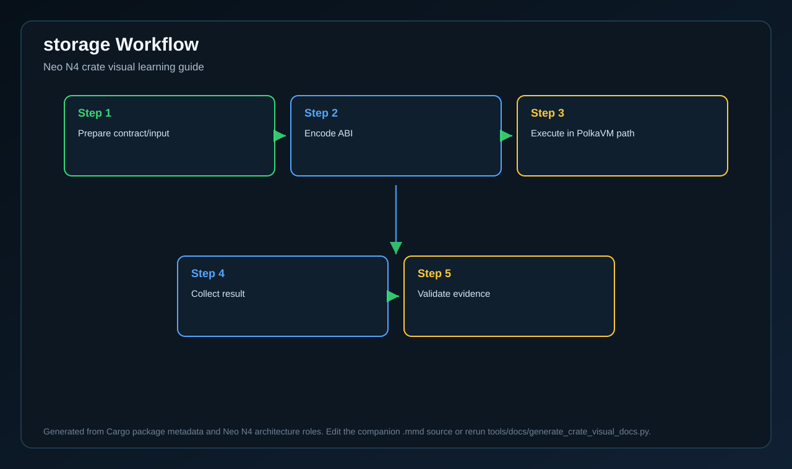
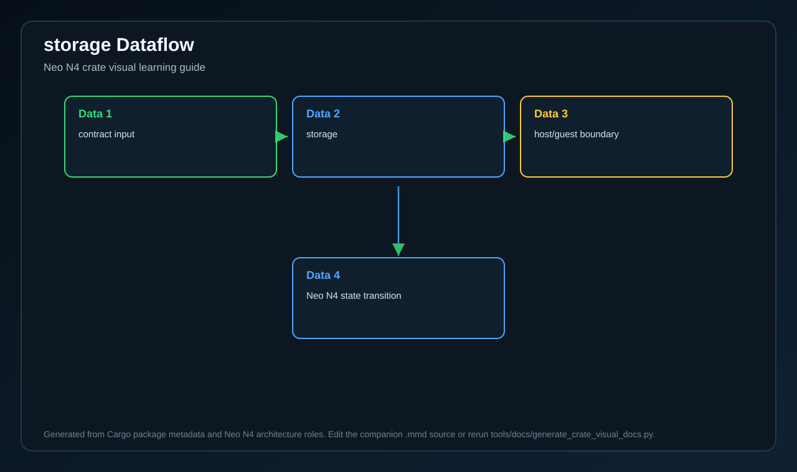

# storage

<!-- N4-CRATE-VISUAL-GUIDE:START -->

## Crate Visual Learning Guide

These diagrams are local to this crate. They explain `storage` as an independent unit: where it sits in the Neo N4 stack, which boundary it owns, how its internal workflow runs, and how data moves through it.

| View | Diagram | Source |
| --- | --- | --- |
| Position in Neo N4 |  | [Mermaid](docs/figures/position.mmd) |
| Technical principles |  | [Mermaid](docs/figures/principles.mmd) |
| Architecture |  | [Mermaid](docs/figures/architecture.mmd) |
| Workflow |  | [Mermaid](docs/figures/workflow.mmd) |
| Dataflow |  | [Mermaid](docs/figures/dataflow.mmd) |

### Role in Neo N4

- **Layer:** NeoVM2 / RISC-V execution profile
- **Purpose:** Storage-focused contract example for host syscall behavior.
- **Primary inputs:** developer source, template runtime, test context
- **Primary outputs:** compiled contract, example result, tutorial artifact
- **Downstream consumers:** RISC-V host, Neo N4 L2 node, developer tooling

### Boundary and Responsibilities

- **Owns:** Demonstrate contract pattern, Exercise tooling, Provide learning fixture
- **Consumes:** developer source, template runtime, test context
- **Produces:** compiled contract, example result, tutorial artifact
- **Used by:** RISC-V host, Neo N4 L2 node, developer tooling

### Learning Path

1. Start with the position diagram to understand why this crate exists and who calls it.
2. Read the technical principles diagram to identify the invariants and responsibility boundary.
3. Use the architecture diagram to connect public inputs, internal components, dependencies, and outputs.
4. Follow the workflow and dataflow diagrams before reading source files or tests.

<!-- N4-CRATE-VISUAL-GUIDE:END -->
