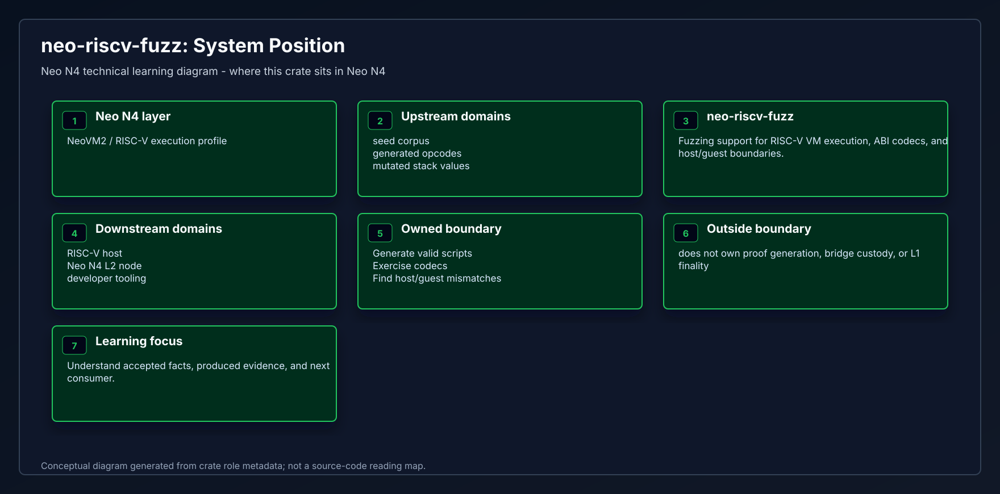
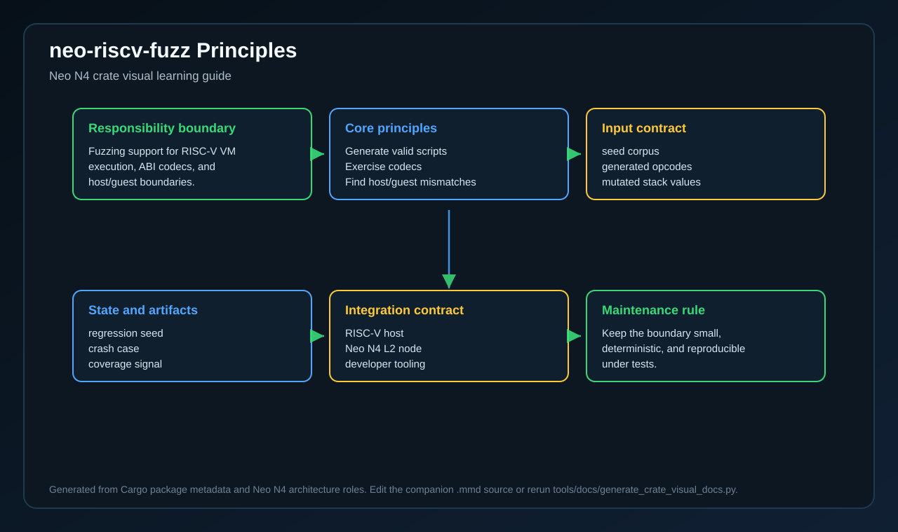
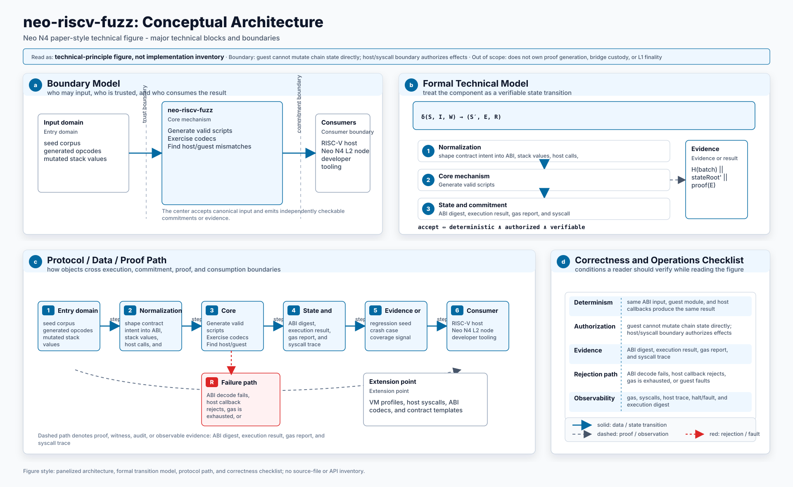
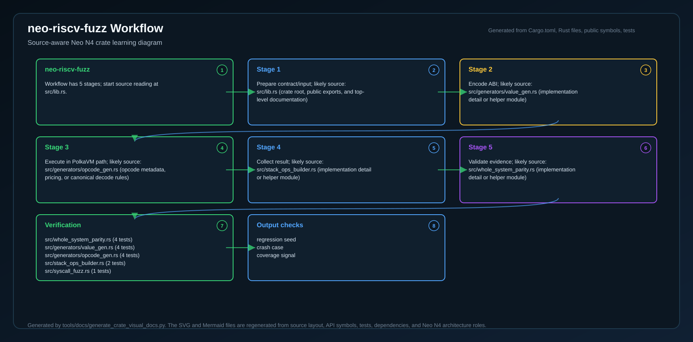
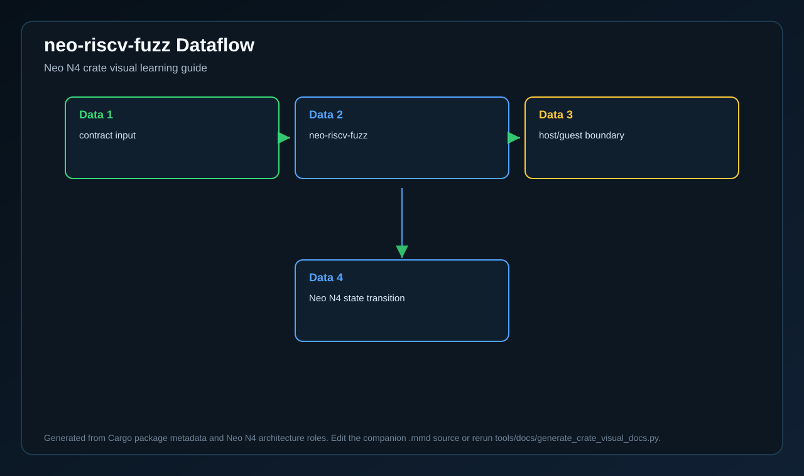
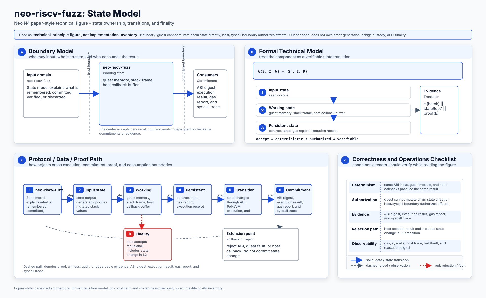
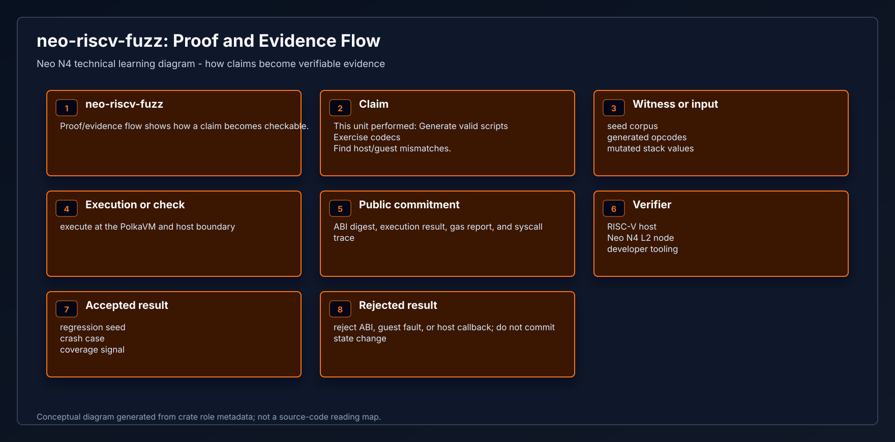
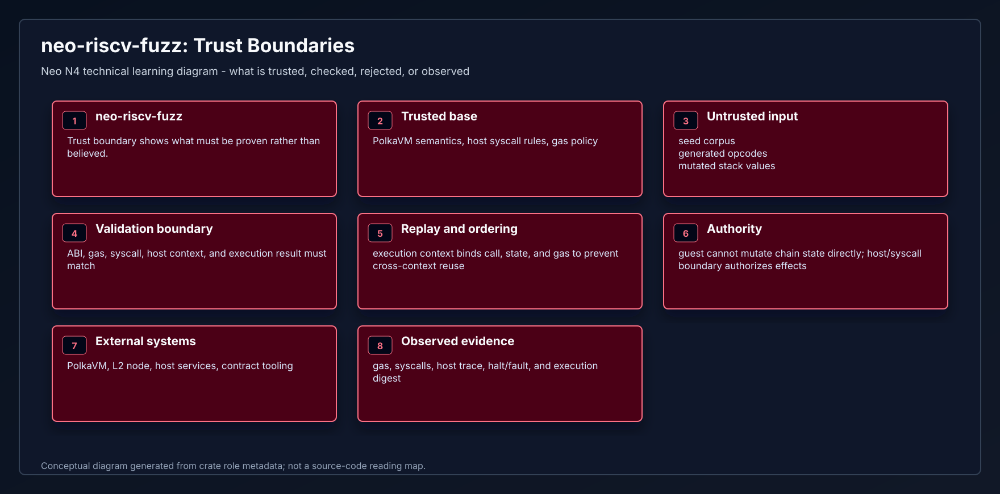
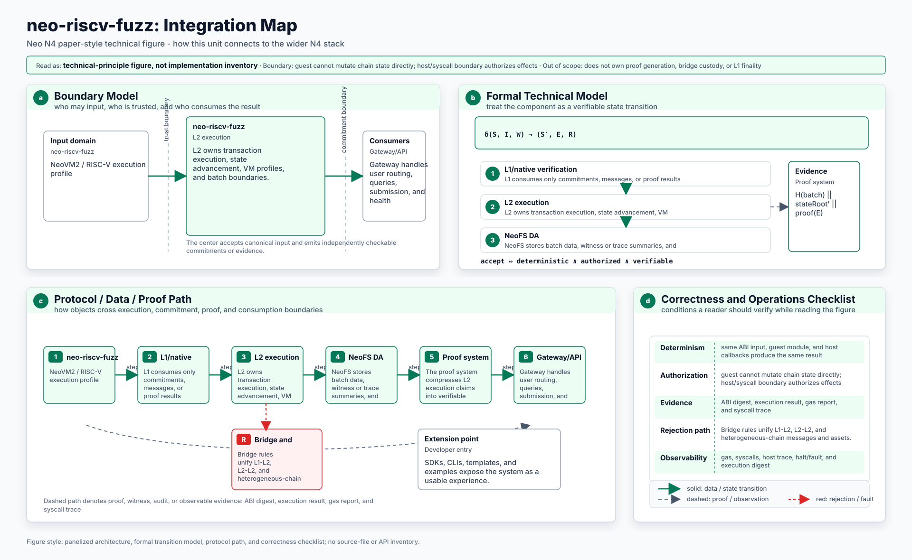
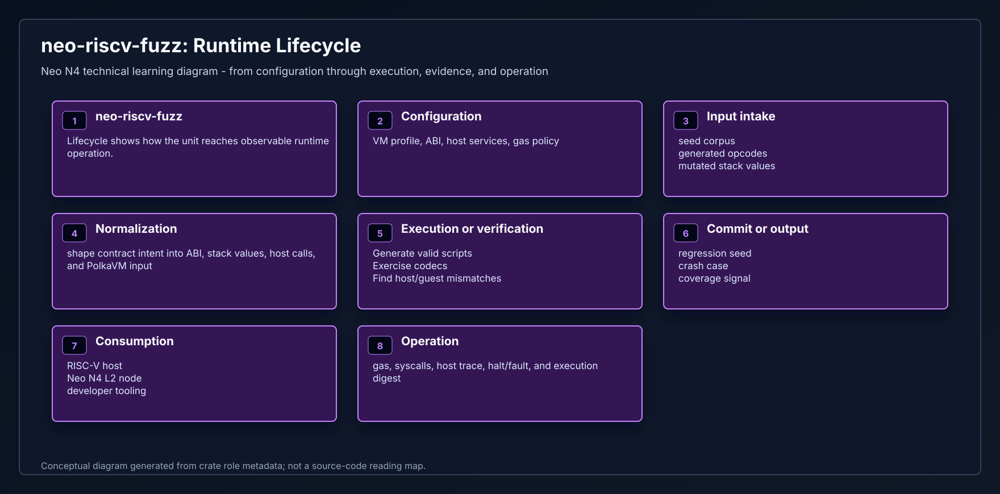

# Neo RISC-V VM Fuzzing

This package contains libFuzzer-compatible entrypoints for stressing the guest
interpreter with randomly generated scripts, values, and syscall responses.

## Targets

| Target | Purpose |
|--------|---------|
| `opcode_seq` | Random opcode sequence execution |
| `type_convert` | Type conversion operations such as `ISTYPE` and `CONVERT` |
| `stack_ops` | Stack manipulation operations such as `DUP`, `DROP`, and `SWAP` |
| `exception_handling` | `TRY`, `THROW`, and `ENDTRY` control flow |
| `syscall_fuzz` | Syscall invocation and return value handling |
| `whole_system_parity` | Direct guest versus host-path parity for structured syscall scenarios |
| `mem_op` | Memory operations such as `MEMCPY`, `SUBSTR`, and `CAT` |

## Build

```bash
cd fuzz
cargo +nightly fuzz build opcode_seq
cargo +nightly fuzz build whole_system_parity
```

## Run

Run the instrumented harnesses through `cargo-fuzz`:

```bash
cd fuzz
cargo +nightly fuzz run opcode_seq -- fuzz/corpus/opcodes/
cargo +nightly fuzz run opcode_seq -- -max_total_time=300 fuzz/corpus/opcodes/
cargo +nightly fuzz run whole_system_parity -- -runs=100
```

## Corpus

Seed inputs live under `fuzz/corpus/`. The committed opcode corpus provides a
stable starting point for local smoke fuzzing and CI time-boxed runs.

## CI Pattern

```bash
cargo build -p neo-riscv-fuzz --release
./target/release/opcode_seq -max_total_time=600 fuzz/corpus/opcodes/
```

## Bounded validation helper

`scripts/run-bounded-fuzz.sh` captures the supported fuzz binaries and gives them a repeatable, bounded execution window on the current workspace. The script uses `cargo +nightly fuzz run` for instrumented libFuzzer execution, then runs `opcode_seq`, `type_convert`, `stack_ops`, `exception_handling`, `syscall_fuzz`, `whole_system_parity`, and `mem_op` with `-max_total_time`, `-runs`, and `-seed` arguments so each harness exits within a predictable wall-clock budget. `opcode_seq` points at `fuzz/corpus/opcodes/` if it exists; the other targets use `fuzz/corpus/<target>/` when present.

Default guardrails are `TIME_PER_TARGET=120`, `RUNS_PER_TARGET=100`, and `FUZZ_SEED=42`, but you can override them when invoking the script. For example:

```bash
TIME_PER_TARGET=10 RUNS_PER_TARGET=5 FUZZ_SEED=123 scripts/run-bounded-fuzz.sh
```

To keep fuzz validation optional, `scripts/verify-all.sh` will run `scripts/run-bounded-fuzz.sh` only when you set `NEO_RUN_FUZZ=1`. That lets CI opt into fuzzing or lets developers run `NEO_RUN_FUZZ=1 scripts/verify-all.sh` after the normal test suite finishes.

## Invariants

The fuzz harnesses assert:

1. The interpreter does not panic.
2. Returned stack values stay structurally valid.
3. Fault and halt states remain internally consistent.
4. Generated byte strings, collections, and big integers stay within expected bounds.

<!-- N4-CRATE-VISUAL-GUIDE:START -->
## Technical Visual Guide

These diagrams are local to this crate and explain `neo-riscv-fuzz` at the technical architecture level. They focus on system role, principles, data movement, workflow, state, proof/evidence, trust boundaries, integration, and runtime lifecycle.

Full technical explanation: [docs/learning-guide.md](docs/learning-guide.md).

| View | Diagram | Mermaid |
| --- | --- | --- |
| System Position |  | [Mermaid](docs/figures/position.mmd) |
| Technical Principles |  | [Mermaid](docs/figures/principles.mmd) |
| Conceptual Architecture |  | [Mermaid](docs/figures/architecture.mmd) |
| Workflow |  | [Mermaid](docs/figures/workflow.mmd) |
| Data Flow |  | [Mermaid](docs/figures/dataflow.mmd) |
| State Model |  | [Mermaid](docs/figures/state-model.mmd) |
| Proof and Evidence Flow |  | [Mermaid](docs/figures/proof-flow.mmd) |
| Trust Boundaries |  | [Mermaid](docs/figures/trust-boundaries.mmd) |
| Integration Map |  | [Mermaid](docs/figures/integration-map.mmd) |
| Runtime Lifecycle |  | [Mermaid](docs/figures/lifecycle.mmd) |

### Technical Role

- **Layer:** NeoVM2 / RISC-V execution profile
- **Purpose:** Fuzzing support for RISC-V VM execution, ABI codecs, and host/guest boundaries.
- **Inputs:** seed corpus | generated opcodes | mutated stack values
- **Responsibilities:** Generate valid scripts | Exercise codecs | Find host/guest mismatches
- **Outputs:** regression seed | crash case | coverage signal
- **Consumers:** RISC-V host | Neo N4 L2 node | developer tooling

### Reading Order

1. Start with system position and conceptual architecture.
2. Read technical principles, trust boundaries, and state model to understand correctness.
3. Follow workflow and dataflow to see runtime movement.
4. Use proof/evidence flow, integration map, and lifecycle for operational understanding.
<!-- N4-CRATE-VISUAL-GUIDE:END -->
