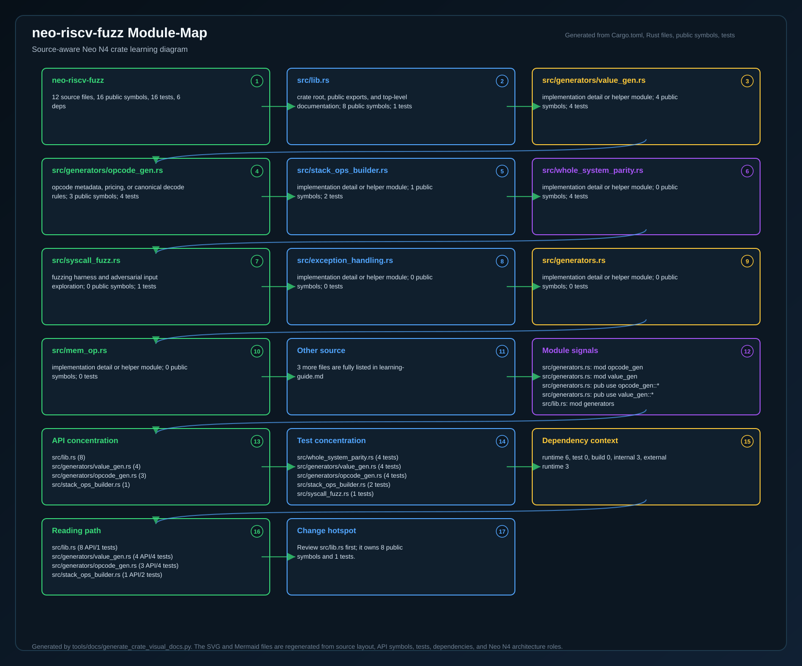
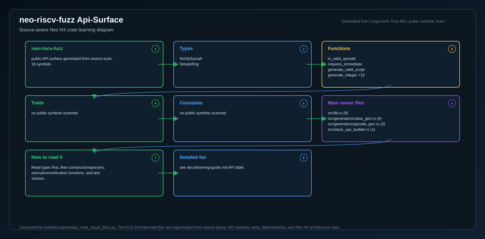
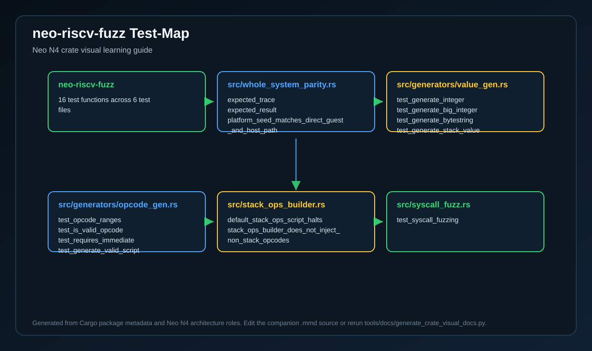
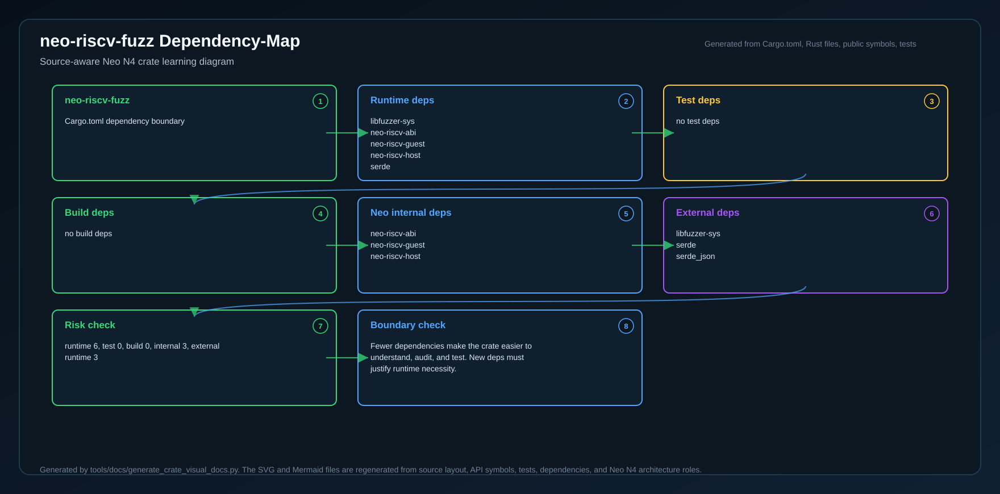
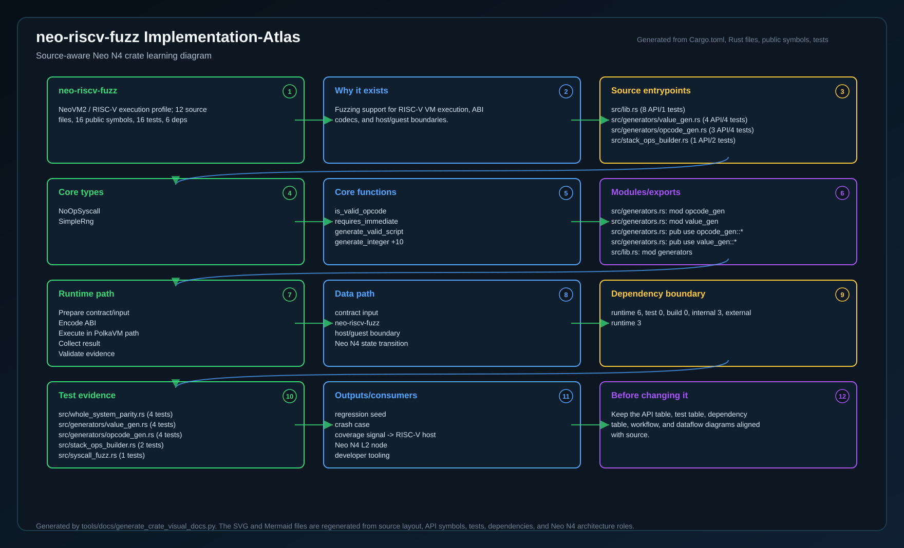

# Neo RISC-V VM Fuzzing

This package contains libFuzzer-compatible entrypoints for stressing the guest
interpreter with randomly generated scripts, values, and syscall responses.

## Targets

| Target | Purpose |
|--------|---------|
| `opcode_seq` | Random opcode sequence execution |
| `type_convert` | Type conversion operations such as `ISTYPE` and `CONVERT` |
| `stack_ops` | Stack manipulation operations such as `DUP`, `DROP`, and `SWAP` |
| `exception_handling` | `TRY`, `THROW`, and `ENDTRY` control flow |
| `syscall_fuzz` | Syscall invocation and return value handling |
| `whole_system_parity` | Direct guest versus host-path parity for structured syscall scenarios |
| `mem_op` | Memory operations such as `MEMCPY`, `SUBSTR`, and `CAT` |

## Build

```bash
cd fuzz
cargo +nightly fuzz build opcode_seq
cargo +nightly fuzz build whole_system_parity
```

## Run

Run the instrumented harnesses through `cargo-fuzz`:

```bash
cd fuzz
cargo +nightly fuzz run opcode_seq -- fuzz/corpus/opcodes/
cargo +nightly fuzz run opcode_seq -- -max_total_time=300 fuzz/corpus/opcodes/
cargo +nightly fuzz run whole_system_parity -- -runs=100
```

## Corpus

Seed inputs live under `fuzz/corpus/`. The committed opcode corpus provides a
stable starting point for local smoke fuzzing and CI time-boxed runs.

## CI Pattern

```bash
cargo build -p neo-riscv-fuzz --release
./target/release/opcode_seq -max_total_time=600 fuzz/corpus/opcodes/
```

## Bounded validation helper

`scripts/run-bounded-fuzz.sh` captures the supported fuzz binaries and gives them a repeatable, bounded execution window on the current workspace. The script uses `cargo +nightly fuzz run` for instrumented libFuzzer execution, then runs `opcode_seq`, `type_convert`, `stack_ops`, `exception_handling`, `syscall_fuzz`, `whole_system_parity`, and `mem_op` with `-max_total_time`, `-runs`, and `-seed` arguments so each harness exits within a predictable wall-clock budget. `opcode_seq` points at `fuzz/corpus/opcodes/` if it exists; the other targets use `fuzz/corpus/<target>/` when present.

Default guardrails are `TIME_PER_TARGET=120`, `RUNS_PER_TARGET=100`, and `FUZZ_SEED=42`, but you can override them when invoking the script. For example:

```bash
TIME_PER_TARGET=10 RUNS_PER_TARGET=5 FUZZ_SEED=123 scripts/run-bounded-fuzz.sh
```

To keep fuzz validation optional, `scripts/verify-all.sh` will run `scripts/run-bounded-fuzz.sh` only when you set `NEO_RUN_FUZZ=1`. That lets CI opt into fuzzing or lets developers run `NEO_RUN_FUZZ=1 scripts/verify-all.sh` after the normal test suite finishes.

## Invariants

The fuzz harnesses assert:

1. The interpreter does not panic.
2. Returned stack values stay structurally valid.
3. Fault and halt states remain internally consistent.
4. Generated byte strings, collections, and big integers stay within expected bounds.

<!-- N4-CRATE-VISUAL-GUIDE:START -->

## Crate Visual Learning Guide

These diagrams are local to this crate. They explain `neo-riscv-fuzz` as an independent unit: where it sits in the Neo N4 stack, which boundary it owns, how its internal workflow runs, and how data moves through it.

For the full source-level explanation, read [docs/learning-guide.md](docs/learning-guide.md).

| View | Diagram | Source |
| --- | --- | --- |
| Position in Neo N4 |  | [Mermaid](docs/figures/position.mmd) |
| Technical principles |  | [Mermaid](docs/figures/principles.mmd) |
| Architecture |  | [Mermaid](docs/figures/architecture.mmd) |
| Workflow |  | [Mermaid](docs/figures/workflow.mmd) |
| Dataflow |  | [Mermaid](docs/figures/dataflow.mmd) |
| Module map |  | [Mermaid](docs/figures/module-map.mmd) |
| Public API surface |  | [Mermaid](docs/figures/api-surface.mmd) |
| Test evidence |  | [Mermaid](docs/figures/test-map.mmd) |
| Dependency map |  | [Mermaid](docs/figures/dependency-map.mmd) |
| Implementation atlas |  | [Mermaid](docs/figures/implementation-atlas.mmd) |

### Role in Neo N4

- **Layer:** NeoVM2 / RISC-V execution profile
- **Purpose:** Fuzzing support for RISC-V VM execution, ABI codecs, and host/guest boundaries.
- **Primary inputs:** seed corpus, generated opcodes, mutated stack values
- **Primary outputs:** regression seed, crash case, coverage signal
- **Downstream consumers:** RISC-V host, Neo N4 L2 node, developer tooling
- **Source files scanned:** 12
- **Public symbols scanned:** 16
- **Rust tests scanned:** 16

### Boundary and Responsibilities

- **Owns:** Generate valid scripts, Exercise codecs, Find host/guest mismatches
- **Consumes:** seed corpus, generated opcodes, mutated stack values
- **Produces:** regression seed, crash case, coverage signal
- **Used by:** RISC-V host, Neo N4 L2 node, developer tooling

### Source Map Snapshot

| File | Why it matters | Public API | Tests |
| --- | --- | ---: | ---: |
| `src/lib.rs` | crate root, public exports, and top-level documentation | 8 | 1 |
| `src/generators/value_gen.rs` | implementation detail or helper module | 4 | 4 |
| `src/generators/opcode_gen.rs` | opcode metadata, pricing, or canonical decode rules | 3 | 4 |
| `src/stack_ops_builder.rs` | implementation detail or helper module | 1 | 2 |
| `src/whole_system_parity.rs` | implementation detail or helper module | 0 | 4 |
| `src/syscall_fuzz.rs` | fuzzing harness and adversarial input exploration | 0 | 1 |
| `src/exception_handling.rs` | implementation detail or helper module | 0 | 0 |
| `src/generators.rs` | implementation detail or helper module | 0 | 0 |

### API Snapshot

| Kind | Representative symbols |
| --- | --- |
| Types | NoOpSyscall <br> SimpleRng |
| Functions | is_valid_opcode <br> requires_immediate <br> generate_valid_script <br> generate_integer +10 |
| Trait | no public symbols scanned |
| Constants | no public symbols scanned |

### Learning Path

1. Start with the position diagram to understand why this crate exists and who calls it.
2. Read the technical principles diagram to identify the invariants and responsibility boundary.
3. Use the module map and API surface to identify the files and symbols to read first.
4. Follow the workflow, dataflow, test, and dependency diagrams before changing code.
5. Use the implementation atlas as the compact source-reading map when you want one dense view instead of separate technical views.

<!-- N4-CRATE-VISUAL-GUIDE:END -->
